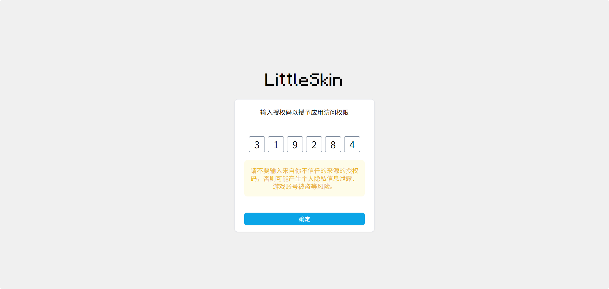

# 通过设备代码流获取 OAuth 访问令牌

<!--@include: ../for-experts.template.md-->

_设备授权授予（Device Authorization Grant）_ 使用 **设备代码流（Device Code Flow）** 获取访问令牌（Access Token）。

若要了解关于设备授权授予和设备代码流的更多信息，请参阅 [RFC 8628](https://datatracker.ietf.org/doc/html/rfc8628)。

> [!NOTE] 适用场景
>
> - 用户输入受限
> - 无后端服务器的 SPA 或原生应用

> [!NOTE] 其他授权方式
> 对于有后端服务器，且希望应用通过后端服务器获取访问令牌的场景，建议使用 [授权代码流](./authorization-code-grant.md)。

> [!TIP] 请求 ID
> 正常情况下，该部分 API 的所有 HTTP 响应中均包含 `X-Yggdralt-Req-ID` 头，其值为本次请求对应的请求 ID。
>
> LittleSkin 运营组可通过请求 ID 快速了解请求详情，因此，在通过 LittleSkin 官方渠道寻求协助时，请务必提供请求 ID。

## 申请设备代码流白名单

由于公共客户端存在潜在的安全问题，若要使用设备代码流获取访问令牌，需要先为应用申请设备代码流白名单。

请先在  [<BSSection>OAuth 2 应用管理</BSSection>](https://littleskin.cn/user/oauth/manage) 中，将应用的回调 URL 设置为 `https://open.littleskin.cn/oauth/callback`，然后使用你的 LittleSkin 账号绑定的邮箱发送 [邮件工单](../../email.md)，在邮件标题中注明「申请 OAuth 设备代码流白名单」，并在邮件正文中提供你的应用名称和客户端 ID。如应用需要申请 Yggdrasil 相关权限，还应在邮件正文中提供具体需要申请的 Yggdrasil 相关权限的列表。

LittleSkin 运营组会在一周内审核你的申请，视情况将应用添加至白名单中，并通过邮件回复审核结果。如果运营组长时间未回复，请加入我们的 [官方用户交流群](../../user-group.md)，联系站点管理员处理。

> [!WARNING] 测试模式
> 如无特别说明，初次申请设备代码流白名单的应用将会被设为测试模式，仅允许应用的创建者进行授权。如需投入生产环境使用，请在应用开发完成后再次发送邮件工单，申请解除测试模式。

## 请求设备代码对

设备代码对包含一个用户代码（User Code）和一个设备代码（Device Code）。用户需要在授权页面输入用户代码以授予应用权限，而设备代码用于应用查询授权结果。

客户端需要向 LittleSkin 发送如下请求，请求一个设备代码对：

```http
// 请求体中的换行只是为了方便阅读，实际发起请求时不应换行，下同
POST https://open.littleskin.cn/oauth/device_code HTTP/1.1
Accept: application/json
Content-Type: application/x-www-form-urlencoded

client_id={{client_id}}&
scope={{scope}}
```

| 参数        | 值                                     |
| ----------- | -------------------------------------- |
| `client_id` | LittleSkin 分配的客户端 ID              |
| `scope`     | 要申请的权限列表，多个权限节点间以空格分隔 |

若 `scope` 参数为空，则默认为 `User.Read`。

> [!TIP] 了解有效的 scope 权限列表
> 要了解具体的每个 API 要求申请的权限，请查阅 [LittleSkin API](../api.md)。

> [!IMPORTANT] 在授权时选择角色
> 对于仅需要单一角色的 Yggdrasil 档案的应用（如启动器），可在请求设备代码对时同时申请 `openid` 和 `Yggdrasil.PlayerProfiles.Select` 权限。
>
> 与之相对的，若不申请此权限，则需要在应用内实现角色选择。
>
> - 申请该权限后，用户在授权时会被要求选择角色；
> - 用户授权完成后，LittleSkin 会在 ID 令牌中添加 `selectedProfile` 声明，其值即为用户选择的角色的 Yggdrasil 档案。
>
> ⚠️ 该特性暂时只在设备代码流中支持。对于授权代码流，需要在应用内实现角色选择。

❌ 如果应用不在白名单内，LittleSkin 会返回 `invalid_client` 错误；  
✅ 如果应用在白名单内，LittleSkin 将返回如下响应：

```http
HTTP/1.1 200 OK
Content-Type: application/json

{
    "user_code": "{{user_code}}",
    "device_code": "{{device_code}}",
    "verification_uri": "https://open.littleskin.cn/oauth/link",
    "verification_uri_complete": "https://open.littleskin.cn/oauth/link?user_code={{user_code}}",
    "expires_in": 300,
    "interval": 5
}
```

| 参数                        | 类型   | 值                                                           |
| --------------------------- | ------ | ------------------------------------------------------------ |
| `user_code`                 | string | 用户代码，需要展示给用户，让用户在授权页面输入此代码以授予应用权限 |
| `device_code`               | string | 设备代码，用于应用轮询授权结果，不应展示给用户           |
| `verification_uri`          | string | 授权页面 URL，需要将用户引导至此 URL 输入授权代码以进行授权  |
| `verification_uri_complete` | string | 带用户代码的授权页面 URL，如用户访问此 URL，则授权代码将自动代入输入框中，无需用户手动输入 ✨ |
| `expires_in`                | number | 代码对有效期，单位为秒                                       |
| `interval`                  | number | 应用轮询授权结果时的最小轮询间隔时间，单位为秒               |

此时即获取到了设备代码对。应用需暂时留存设备代码（`device_code`），并将用户代码（`user_code`）展示给用户。

然后，应用需要引导用户或直接打开 / 调用浏览器，访问授权页面，并按页面提示操作。授权页面的的 URL 为上方响应中的 `verification_uri` 或 `verification_uri_complete`。



> [!NOTE] 授权码
> 在打开的授权页面中，用户代码（`user_code`）被称为「**授权码**」以帮助用户理解。
>
> 请尽可能在应用中使用与授权页面上相同的描述。

## 轮询授权结果

在等待用户完成授权时，应用应以 `interval` 为间隔，向 LittleSkin 发送如下请求，轮询授权结果：

```http
POST https://open.littleskin.cn/oauth/token HTTP/1.1
Accept: application/json
Content-Type: application/x-www-form-urlencoded

grant_type=urn:ietf:params:oauth:grant-type:device_code&
client_id={{client_id}}&
device_code={{device_code}}
```

| 参数          | 值                                                    |
| ------------- | ----------------------------------------------------- |
| `grant_type`  | 固定为 `urn:ietf:params:oauth:grant-type:device_code` |
| `client_id`   | 客户端 ID，需与请求设备代码对时使用的客户端 ID 一致      |
| `device_code` | 先前请求到的设备代码                                  |

如用户尚未完成授权，LittleSkin 将返回 `authorization_pending` 错误；用户完成授权后，LittleSkin 会返回如下响应：

```http
HTTP/1.1 200 OK
Content-Type: application/json

{
    "token_type": "Bearer",
    "expires_in": 259200,
    "access_token": "{{access_token}}",
    "id_token": "{{id_token}}"
}
```

| 参数            | 类型   | 值                        |
| --------------- | ------ | ------------------------- |
| `token_type`    | string | 访问令牌类型，固定值 Bearer |
| `expires_in`    | number | 访问令牌的有效期，单位为秒   |
| `access_token`  | string | 访问令牌                   |
| `refresh_token` | string | 刷新令牌，仅在申请了 `offline_access` 权限的情况下包含 |
| `id_token`      | string | OpenID Connect 的 ID 令牌，仅在申请了 `openid` 权限的情况下包含 |

至此即完成了设备代码流的所有流程，成功获取到了访问令牌。

### 关于 ID 令牌

ID 令牌（ID Token）是 OpenID Connect 规范的内容。OpenID Connect 是由 OpenID Foundation 提出的一种基于 OAuth 2.0 的用户身份验证协议。若要了解更多关于 OpenID Connect 的信息，请访问 [OpenID 官网](https://openid.net)。

ID 令牌是一个 JWT，其无法作为访问令牌使用，但可用于识别用户身份。当前 LittleSkin 将 ID 令牌作为传递用户身份信息的一种方式，直接对 ID 令牌进行 JWT 验证和解析即可提取出其中包含的用户身份信息：

| 声明              | 类型   | 值                                                          |
| ----------------- | ------ | ---------------------------------------------------------- |
| `aud`             | string | JWT 的受众，一般为客户端 ID                                 |
| `exp`             | number | JWT 的过期时间，UNIX 时间戳                                 |
| `iat`             | number | JWT 的签发时间，UNIX 时间戳                                 |
| `iss`             | string | JWT 的签发者，一个 URL                                     |
| `sub`             | string | JWT 所属的主体，一般为用户的 UID                            |
| `selectedProfile` | object | 仅在申请了 `Yggdrasil.PlayerProfiles.Select` 权限的情况下包含，其值即是用户选择的角色的 Yggdrasil 档案（不包含签名），详见 [Yggdrasil 服务端技术规范 - 角色信息的序列化](https://github.com/yushijinhun/authlib-injector/wiki/Yggdrasil-%E6%9C%8D%E5%8A%A1%E7%AB%AF%E6%8A%80%E6%9C%AF%E8%A7%84%E8%8C%83#%E8%A7%92%E8%89%B2%E4%BF%A1%E6%81%AF%E7%9A%84%E5%BA%8F%E5%88%97%E5%8C%96) |

> [!TIP] 需要单独申请权限
> 若要获取 ID 令牌，则必须在 [请求设备代码对](#请求设备代码对) 时申请 `openid` 权限。

> [!NOTE] 注意
> 当前 LittleSkin 仅在设备代码流中返回 ID 令牌。对于授权代码流，请通过 [Blessing Skin API](../api#blessing-skin-api-文档) 请求用户信息。

#### 获取用于验证 ID 令牌的密钥

LittleSkin 部分实现了 OpenID Connect Discovery。ID 令牌中的 `iss` 声明的值为 JWT 签发者的标识符，是一个 URL。应用可以通过拼接 URL `{iss}/.well-known/openid-configuration` 并向其发起 GET 请求来获取 OpenID Connect Discovery 元数据。

在 OpenID Connect Discovery 元数据中，有一项 `jwks_uri` 属性，其值为一个 URL。向该 URL 发起 GET 请求即可获取到一个 JWKS，其中包含的 JWK 即可用于验证 LittleSkin 签发的 ID 令牌的签名。

> [!WARNING] ID 令牌的签名算法
> 除 RS256 外，LittleSkin 还可能会使用 PS256、ES256 和 EdDSA 算法对 ID 令牌进行签名。在验证 ID 令牌之前，请确定你使用的 JWT 库支持这些算法。

## 刷新访问令牌

为了延长单次授权的有效期，可在访问令牌有效期及过期后一段时间内使用刷新令牌请求刷新访问令牌，以获取一个新的访问令牌。

> [!TIP] 需要单独申请权限
> 若要获取刷新令牌，则必须在 [请求设备代码对](#请求设备代码对) 时申请 `offline_access` 权限。

```http
POST https://open.littleskin.cn/oauth/token HTTP/1.1
Accept: application/json
Content-Type: application/x-www-form-urlencoded

grant_type=refresh_token&
refresh_token={{refresh_token}}&
client_id={{client_id}}&
client_secret={{client_secret}}&
```

| 参数            | 值                     |
| --------------- | ---------------------- |
| `grant_type`    | 固定值 `refresh_token` |
| `refresh_token` | 先前获取到的刷新令牌   |
| `client_id`     | ...                    |

如果请求成功，将返回如下响应：

```http
HTTP/1.1 200 OK
Content-Type: application/json

{
  "token_type": "Bearer",
  "expires_in": 259200,
  "access_token": "******",
  "refresh_token": "******"
}
```

| 参数            | 类型   | 值                        |
| --------------- | ------ | ------------------------- |
| `token_type`    | string | 访问令牌类型，固定值 Bearer |
| `expires_in`    | number | 访问令牌的有效期，单位为秒   |
| `access_token`  | string | 访问令牌                   |
| `refresh_token` | string | 刷新令牌，仅在申请了 `offline_access` 权限的情况下包含 |
| `id_token`      | string | OpenID Connect 的 ID 令牌，仅在申请了 `openid` 权限的情况下包含 |

访问令牌刷新后，原先的访问令牌和刷新令牌将立即失效，之后所有的 API 请求都必须使用新的访问令牌。

## 错误响应

除 [授权代码流 - 错误响应 - 错误类型](./authorization-code-grant.md#错误类型) 中提到的错误类型外，设备代码流还可能返回以下错误：

| 错误类型                | 原因                                        |
| ----------------------- | ------------------------------------------ |
| `authorization_pending` | 用户尚未完成授权，请继续轮询                  |
| `expired_token`         | 设备代码已过期                               |
| `slow_down`             | 应用轮询过快，请等待 `interval` 秒后再发起请求 |

除 `authorization_pending` 和 `slow_down` 错误外，无论何时出现错误响应，应用都应停止轮询，并向用户说明授权失败及可能的原因。
