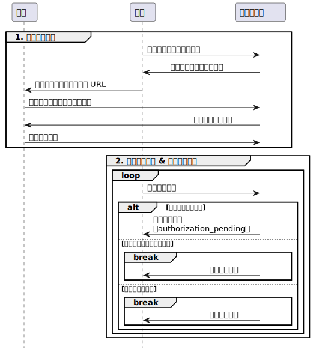

# Yggdrasil Connect 启动器实现规范 <Badge type="warning" text="草案" /> <Badge type="warning" text="测试页面" />

<!-- @include: @/advanced/for-experts.template.md -->
<!-- @include: @/pay-for-minecraft.template.md -->

Yggdrasil Connect 的认证过程与 Microsoft 的认证方式类似，都使用了 Device Code Flow，开发者可以复用部分代码。

Yggdrasil Connect 有部分特性，需要启动器针对性开发。

> [!TIP] 🤓 部分内容已被折叠
> 由于 Device Code Flow 是已被标准化的，笔者认为很多内容都是常识性的，故此文档对这类内容予以折叠或不做说明。

<NCard title="📃 Microsoft 标识平台和 OAuth 2.0 设备权限授予流" link="https://learn.microsoft.com/zh-cn/entra/identity-platform/v2-oauth2-device-code" target="_blank">
Yggdrasil Connect 的 OAuth 流程与 Microsoft 文档基本相同
</NCard>

<details>
<summary>Device Code Flow 示意图</summary>



</details>

---

此文章将介绍启动器使用 Yggdrasil Connect 从用户登录到启动 Minecraft 本体的过程。

[[toc]]

## 0. 准备

在本例中，使用 Yggdrasil Connect 的启动器需要事先在服务端处注册自身，以获取必要的信息。

| 属性        | 描述                     | 备注                      |
| ----------- | ------------------------ | ------------------------- |
| `client_id` | 客户端 ID                | 应用的唯一标识符          |
| **`scope`** | 应用要使用的权限范围列表 | 各个 scope 之间以空格分隔 |

在本例中，启动器将使用到以下 scope:

- `openid`
- `offline_access`
- `Yggdrasil.PlayerProfiles.Select`

<NCard title="📃 可用的 scopes" link="/advanced/oauth2/scopes" target="_blank">
查看可用的 scopes 列表
</NCard>

## 1. 服务发现

> [!TIP]
> Yggdrasil Connect 的服务发现依赖于 [authlib-injector API 元数据获取](https://github.com/yushijinhun/authlib-injector/wiki/%E5%90%AF%E5%8A%A8%E5%99%A8%E6%8A%80%E6%9C%AF%E8%A7%84%E8%8C%83#%E5%9C%A8%E5%90%AF%E5%8A%A8%E5%99%A8%E4%B8%AD%E8%BE%93%E5%85%A5%E5%9C%B0%E5%9D%80) 。

✅ 在获取 authlib-injector API 元数据后，元数据中应包含一个 `feature.openid_configuration_url` 字段，其值为该验证服务器的 **OpenID 提供者的元数据的 URL**。

```jsonc:line-numbers
// GET https://example.com/api/yggdrasil
{
  "meta": {
    "serverName": "Example Server",
    "implementationName": "Yggdrasil Connect",
    "implementationVersion": "0.0.0",
    // ...
    "feature.openid_configuration_url": "https://example.com/.well-known/openid-configuration" // [!code focus] // [!code ++]
  },
  // ...
}
```

> [!NOTE]
> 若验证服务器的 authlib-injector API 元数据中不包含该字段，则应认为该验证服务器不支持 Yggdrasil Connect。

## 2. 获取 OpenID 提供者元数据 <Badge type="tip" text="Device Code Flow" />

<details>

```jsonc:line-numbers
// GET https://example.com/.well-known/openid-configuration
{
    "issuer": "https://example.com",
    "jwks_uri": "https://example.com/.well-known/jwks",
    "subject_types_supported": [
        "pairwise"
    ],
    "id_token_signing_alg_values_supported": [
        "RS256",
        "ES256",
        "EdDSA"
    ],
    "scopes_supported": [
        "openid",
        "offline_access",
        "Yggdrasil.PlayerProfiles.Select",
        "Yggdrasil.PlayerProfiles.Read",
        "Yggdrasil.Server.Join"
    ],
    "authorization_endpoint": "https://example.com/oidc/authorize",
    "device_authorization_endpoint": "https://example.com/oidc/device_code",
    "token_endpoint": "https://example.com/oidc/oauth/token",
    "userinfo_endpoint": "https://example.com/oidc/userinfo",
    "shared_client_id": "example_shared_client_id"
}
```

</details>

## 3. 请求用户授权 <Badge type="tip" text="Device Code Flow" />

<details>

⬆️ 启动器向 `device_authorization_endpoint` 发起 POST 请求，获取请求用户授权所需要的信息。

```http
POST https://example.com/oidc/device_code HTTP/1.1
Accept: application/json
Content-Type: application/x-www-form-urlencoded

client_id=DEMO_CLIENT&scope=openid%20offline_access%20Yggdrasil.PlayerProfiles.Select
```

> [!NOTE] ⬆️ 请求体
>
> | 键 | 值 |  备注 |
> | --- | --- | --- |
> | `client_id` | `DEMO_CLIENT` | 已注册的应用唯一标识符 |
> | `scope` | `openid offline_access Yggdrasil.PlayerProfiles.Select` | 各个 scope 之间以空格分隔 |

⬇️ 若没有错误产生，服务器会返回如下响应：

```http
HTTP/1.1 200 OK
Content-Type: application/json

{
    "user_code": "USER_CODE",
    "device_code": "DEVICE_CODE",
    "verification_uri": "https://example.com/oidc/oauth/link",
    "verification_uri_complete": "https://example.com/oidc/oauth/link?user_code=USER_CODE",  // [!code ++]
    "expires_in": 300,
    "interval": 5
}
```

> [!NOTE] ⬇️ 响应体
>
> | 键 | 值 | 是否必须 | 描述 | 备注 |
> | **`verification_uri_complete`** | `https://example.com/oidc/oauth/link?user_code=USER_CODE` | 可选 | 带用户代码的授权页面 URL | 用户访问此 URL，授权代码将自动代入输入框中，无需手动输入 |
>
> 🤓 _笔者不认为有必要解释这部分的其余内容，请参考 OAuth 2.0 标准_

获取到设备代码和用户代码后，应用应引导用户访问授权页面，并按页面提示操作。

</details>

> [!NOTE] 引导用户访问授权页面的建议
>
> 1. 在 `verification_uri_complete` 存在的情况下，建议启动器直接通过浏览器打开 `https://example.com/oidc/oauth/link?user_code=USER_CODE` 进行访问，用户代码将自动填充到输入框中，无需用户手动输入，启动器也无需做过多的引导提示。
> 2. 为了便于用户理解，除了标准称呼 **用户代码** 外，启动器也可对用户称其为 **授权码**。

> [!IMPORTANT] 🤩 关于自动填充用户代码
> 与 Microsoft 的服务端实现不同，即使 `verification_uri_complete` 在 Device Code Flow 标准中只是一个可选项，本规范依旧建议 Yggdrasil Connect 服务端实现这一属性。

## 4. 等待用户在浏览器中完成授权


## 5. 获取授权结果和访问令牌 <Badge type="tip" text="Device Code Flow" />

<details>

⬆️ 在等待用户完成授权时，启动器需要在后台以 `interval` 为间隔，向 `token_endpoint` 发送 POST 请求。

```http
POST https://example.com/oidc/oauth/token HTTP/1.1
Accept: application/json
Content-Type: application/x-www-form-urlencoded

grant_type=urn:ietf:params:oauth:grant-type:device_code&client_id=DEMO_CLIENT&device_code=DEVICE_CODE
```

> [!NOTE] ⬆️ 请求体
>
> | 键 | 值 | 备注 |
> | --- | --- | --- |
> | `grant_type` | `urn:ietf:params:oauth:grant-type:device_code` | 固定值 |
> | `client_id` | `DEMO_CLIENT` | 客户端 ID，需与请求设备代码对时使用的客户端 ID 一致 |
> | `device_code` | `DEVICE_CODE` | 本次请求的设备代码 |

⬇️ 如请求无误，且用户已完成授权，则认证服务器会返回以下响应：

```http
HTTP/1.1 200 OK
Content-Type: application/json

{
    "token_type": "Bearer",
    "expires_in": 86400,
    "access_token": "ACCESS_TOKEN",
    "refresh_token": "REFRESH_TOKEN",
    "id_token": "eyJ..."
}
```

> [!NOTE] ⬇️ 响应体
>
> 🤓 _笔者不认为有必要解释这部分内容，请参考 OAuth 2.0 标准_

⬇️☹️ 如请求有误，或用户还未完成授权，认证服务器会在响应体中返回错误：

| 错误类型                | 原因                                             |
| ----------------------- | ------------------------------------------------ |
| `authorization_pending` | 用户尚未完成授权，请继续轮询                     |
| `access_denied`         | 用户或认证服务器最终拒绝授权，请重新请求设备代码 |
| `expired_token`         | 设备代码已过期                                   |

</details>

## 6. 获取用户信息 <Badge type="tip" text="Device Code Flow" />

<details>

对 `userinfo_endpoint` 发送 GET 请求，即可获取用户信息：

```http
GET https://example.com/oidc/oauth/userinfo HTTP/1.1
Accept: application/json
Authorization: Bearer ACCESS_TOKEN
```

</details>

⬇️ 由于使用了 `Yggdrasil.PlayerProfiles.Select` scope，服务端会返回 [用户在浏览器中授权](#4-等待用户在浏览器中完成授权) 时选择的那个角色信息。

> [!NOTE]
> 如果使用了其他 scope，服务端可能会返回不同格式的信息。

```http
HTTP/1.1 200 OK
Content-Type: application/json

{
    "sub": "user_id",
    "aud": "client_id",
    "selectedProfile": {
        "id": "f702c5d39d5c457f80c691c664757092",
        "name": "SSSSSteven"
    }
}
```

> [!WARNING]
> 启动器 **必须忽略** 用户信息端点的响应中的无法识别的声明。

## 7. 启动 Minecraft

配合 authlib-injector，用以下参数启动 Minecraft：

| 参数            | 值             | 备注                         |
| --------------- | -------------- | ---------------------------- |
| `--accessToken` | `ACCESS_TOKEN` | 将之前得到的访问令牌直接传入 |
| `--userType`    | `msa`          | 固定值                       |
| ...             | ...            | ...                          |

## 8. 刷新访问令牌 <Badge type="tip" text="Device Code Flow" />

<details>

⬆️ 对 `token_endpoint` 发送 POST 请求，即可刷新访问令牌：

```http
POST https://example.com/oidc/oauth/token HTTP/1.1
Accept: application/json
Content-Type: application/x-www-form-urlencoded

grant_type=refresh_token&client_id=DEMO_CLIENT&refresh_token=REFRESH_TOKEN
```

> [!NOTE] ⬆️ 请求体
>
> 🤓 _笔者不认为有必要解释这部分内容，请参考 OAuth 2.0 标准_

⬇️ 以下是一个示例响应：

```http
HTTP/1.1 200 OK
Content-Type: application/json

{
    "token_type": "Bearer",
    "expires_in": 86400,
    "access_token": "ACCESS_TOKEN",
    "refresh_token": "REFRESH_TOKEN",
    "id_token": "eyJ..."
}
```

> [!NOTE] ⬇️ 响应体
>
> 🤓 _笔者不认为有必要解释这部分内容，请参考 OAuth 2.0 标准_

</details>
