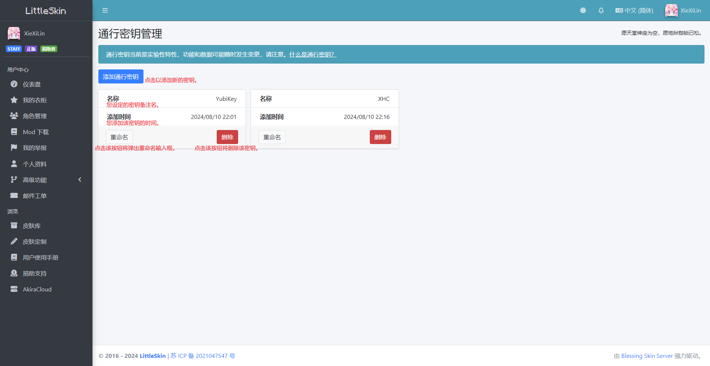
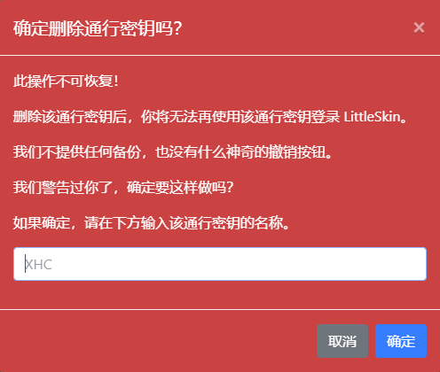

# 使用通行密钥登录 LittleSkin

<!--@include: ./feature-tip.template.md-->

通行密钥（Passkey）是 FIDO 联盟推出的一种更强大的第一方用户身份验证解决方案，可作为密码的替代品，用于注册、登录和多因素认证等需要验证用户身份的场景。相较密码而言，通行密钥使用起来更方便，也更安全。

若要了解更多关于通行密钥的信息，请访问 FIDO 联盟的网站：[通行密钥（通行密钥身份验证）](https://fidoalliance.org/passkeys/?lang=zh-hans)

LittleSkin 当前支持使用通行密钥进行登录。

[[toc]]

## 详解

### 管理当前密钥

进入 [<BSSection>仪表盘</BSSection>](https://littleskin.cn/user) ，点击 [<BSSection style="background-color:#343a40; color:#ffffff; border: none"><FA :icon="faUser" />个人资料</BSSection>](https://littleskin.cn/user/profile) ，找到底部的 [<BSSection style="background-color:#007bff; color:#ffffff; border: none">管理通行密钥</BSSection>](https://littleskin.cn/user/passkey) ，进入通行密钥管理页面。

下图是页面中各信息点的详解：

### 添加通行密钥

在通行密钥管理页面点击 <BSSection style="background-color:#007bff; color:#ffffff; border: none">添加通行密钥</BSSection> ，唤起系统的验证页面。此时请按照页面提示操作，操作成功后即可完成添加。

添加后该密钥将可在[登录页面](https://littleskin.cn/auth/login)内用于 Passkey 快速登录。

### 使用通行密钥登录

在[登录页面](https://littleskin.cn/auth/login)的下方「其他登录方式」处，选择 [<BSSection>Passkey</BSSection>](https://littleskin.cn/auth/passkey) 以使用通行密钥快速登录。

### 删除通行密钥

在通行密钥管理页面点击 <BSSection style="background-color:red; color:#ffffff; border: none">删除</BSSection> ，将弹出删除确认框：

按提示信息输入，点击确认后，即可删除密钥。

删除后，该密钥不能在[登录页面](https://littleskin.cn/auth/login)内用于 Passkey 快速登录。

::: warning 删除前请三思！

删除操作通常是**永久性**的！我们既不能也无法帮你恢复被删除的密钥的信息。
:::

## 在操作过程中遇到问题？

<NCard title="🙋 加入用户交流群" link="/user-group" >
你可以加入我们的官方用户交流群来提问
</NCard>
<NCard title="📬️ 通过邮件发送工单" link="/email" >
也可以给我们发送邮件工单
</NCard>
