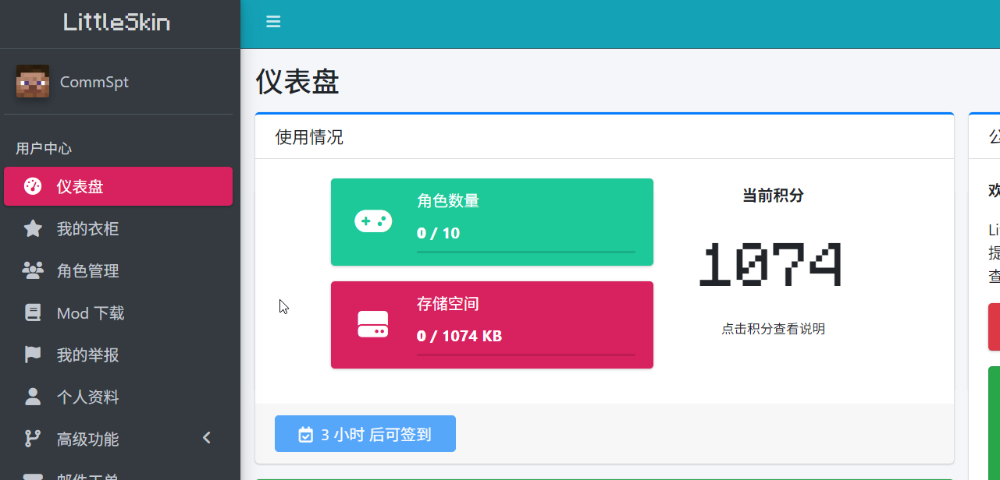
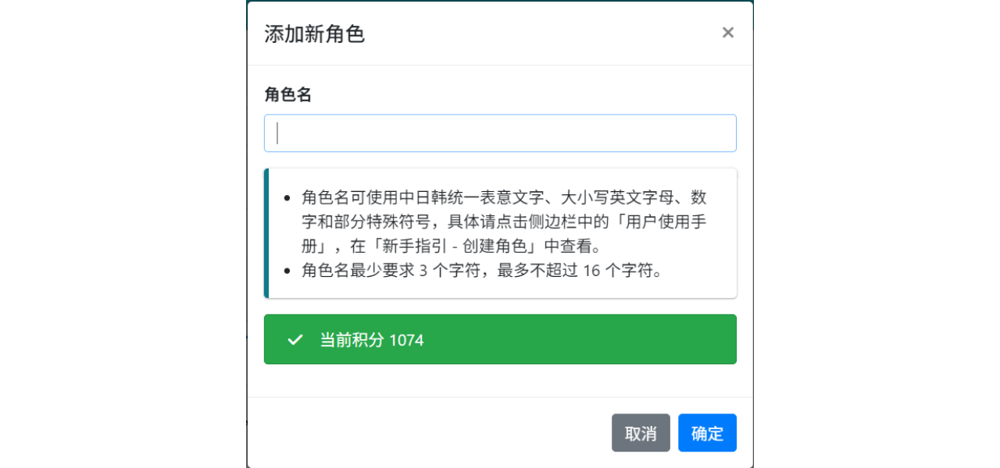

# 创建角色

LittleSkin 支持的皮肤 Mod 都是通过角色名来识别玩家身份并加载材质的，所以你需要先创建你的游戏角色才能在 Minecraft 中加载皮肤。

::: warning 注意
创建一个角色需要花费 100 积分，而删除角色时会返还积分。
在创建角色前请确保你的积分足够，否则你将无法创建角色。
:::

你可以在用户中心的 [<BSSection><FA :icon="faUsers" /> 角色管理</BSSection>](https://littleskin.cn/user/player) 页面创建和管理你的角色：

1. 点击用户中心左侧菜单栏中的 [<BSSection><FA :icon="faUsers" /> 角色管理</BSSection>](https://littleskin.cn/user/player) ，在打开的页面中点击<BSButton><FA :icon="faPlus" />  添加新角色</BSButton>

    

2. 在弹出的窗口中输入你的角色名，点击<BSButton>确定</BSButton>按钮。

    

    对于角色名，必须满足以下要求：

    - ✅ 使用以下文字和符号：
      - 中日韩统一表意文字（即中文、日文、韩文字符）
      - 🔤 大写或小写的英文字母
      - 🔢 数字
      - 🔣 部分常见的符号（见下表）

    - ✅ 最短 3 字符，最长不超过 16 字符

    | 符号名称 | 符号 |
    | -------- | ---- |
    | 下划线   | `_`  |
    | 连字符   | `-`  |
    | 逗号     | `,`  |
    | 点号     | `.`  |
    | 方括号   | `[]` |
    | 花括号   | `{}` |
    | 加号     | `+`  |
    | 等号     | `=`  |
    | 脱字符   | `^`  |

✨ 你的第一个角色就创建好啦~

---

> [!TIP] 名称已被占用？
> 若出现此提示，则说明有其他用户已经使用了这个角色名。
>
> **若你符合下述全部条件**，👉 [绑定正版 Minecraft](./premium) 即可解决你的烦恼。
>
> 1. 你希望使用的角色名已被占用
> 2. 你拥有正版 Minecraft
> 3. 你的正版 Minecraft ID 就是那个被占用的角色名
>
> 若你不满足上述条件，很遗憾，你无法添加被占用的角色名。

<NCard title="😢 角色被别人占用了怎么办？" link="/faq/site#player-already-exists" >
前去查看常见问题解答 FAQ 中的相关内容
</NCard>

<NCard title="🔗 绑定正版 Minecraft" link="./premium" >
了解如何取回被占用的角色名
</NCard>
