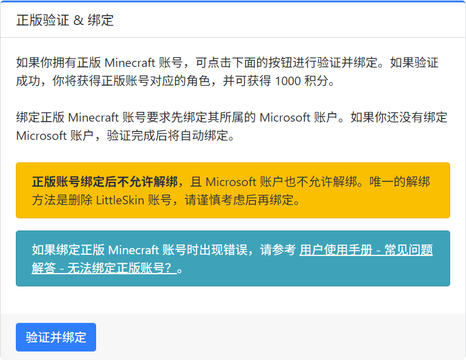

# 绑定正版 Minecraft 账号

如果你拥有正版的 Java 版 Minecraft，你可以将其绑定至你的 LittleSkin 账号。

目前仅支持通过 Microsoft 账号绑定正版的 Java 版 Minecraft 账号。

> [!TIP] 仅支持 Java 版 Minecraft
> 我们只能绑定正版的 Java 版 Minecraft 账号，如果你不拥有，则无法绑定。

> [!CAUTION] 可选的操作
> 这并不是一个必须进行的操作，即使不绑定正版 Minecraft 也不会影响你使用 LittleSkin 的基础功能。

## 绑定正版 Minecraft 账号的作用

一旦绑定成功，你将获得以下好处：

- 🪙 获得 1000 积分奖励！
- 🏅 获得一个 <BSSection style="background-color:#6f42c1; color:#ffffff; border: none">正版</BSSection> 的徽标，并显示在用户中心和皮肤库页面
- ✨ 一个以你的正版 Minecraft 账号的 ID 命名的角色将被添加至你的 LittleSkin 账号

> [!IMPORTANT] 取回被占用的正版 ID
> 如果你希望使用的角色名已被其他人占用，但你**符合以下全部条件**：
>
> 1. 你拥有正版 Minecraft
> 2. 你的正版 Minecraft 账号的 ID（档案名称 / Profile Name）就是你希望使用的那个角色名
>
> 🎉 绑定正版 Minecraft 账号即可立即强制取回你希望使用的那个被占用的角色名。

---

但是，绑定正版 Minecraft 可能并没有你想象中的那么好，它仍然存在以下这些限制：

- ❌ 你**始终无法**使用 LittleSkin 的外置登录功能进入需要正版 Minecraft 账号的服务器，无论是否绑定了正版 Minecraft
- ❌ 你**无法**在 LittleSkin 中自动得到你在正版 Minecraft 账号上设置的皮肤或披风
- ❌ 你在 LittleSkin 网站上设置的皮肤或披风**不会**被自动同步至你的正版 Minecraft 账号

## 绑定前的准备工作

你必须满足**以下全部条件**才能绑定正版 Minecraft 账号：

1. 你已拥有正版的 **Java 版** Minecraft
2. 你的正版 Minecraft 账号是 **Microsoft 账号**，而不是 Mojang 账号
3. 你已为你的正版 Minecraft **设置 档案名称 / Profile Name**（也被称为玩家 ID）

::: details <Badge type="tip">帮助</Badge> 如何设置 _档案名称_ / _Profile Name_？
可前往 [Minecraft 官网 > Java Edition：编辑档案名称](https://www.minecraft.net/msaprofile/mygames/editprofile)
:::

> [!WARNING] 务必知晓以下信息
>
> - 每个 LittleSkin 账户只能绑定 1 个正版 Minecraft 账号
> - 绑定正版 Minecraft 的同时会自动绑定对应的 Microsoft 账号
> - 正版 Minecraft 账号绑定后不允许解绑，对应的 Microsoft 账号也不允许解绑，除非删除 LittleSkin 账号

## 进行绑定

<NCard title="🤔 遇到了问题？" link="/faq/site#microsoft-failed-to-link" >
查看常见问题解答 FAQ 中的有关内容，或寻求我们的帮助。
</NCard>

在 [<BSSection><FA :icon="faUsers" /> 角色管理</BSSection>](https://littleskin.cn/user/player) 页面的下方找到<BSSection>正版验证 & 绑定</BSSection>一栏（如果没有这一栏，请尝试刷新页面），  
点击下方的<BSButton>验证并绑定</BSButton>按钮。

你将被跳转到 Microsoft 的认证页面，在其中登录你的 Microsoft 账号并授权即可完成绑定。

## 更新绑定

在以下情况时，你可以 <BSButton>更新绑定角色</BSButton>

- 你的正版 Minecraft 账号的 ID 发生变化
- 删除对应角色后想要重新创建

> [!INFO] 提示
> 更新绑定角色时同样可以取回被占用的角色名。
