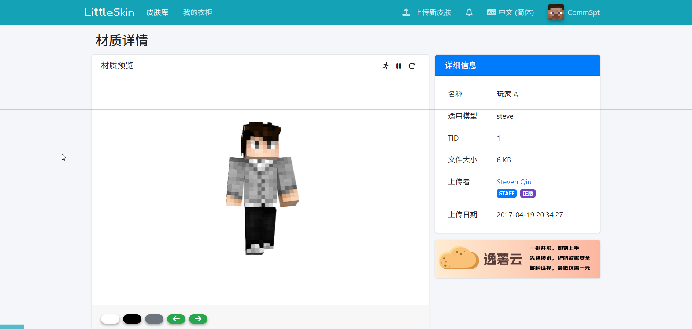
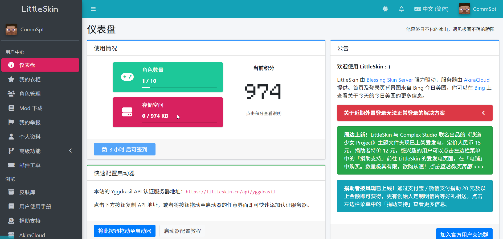
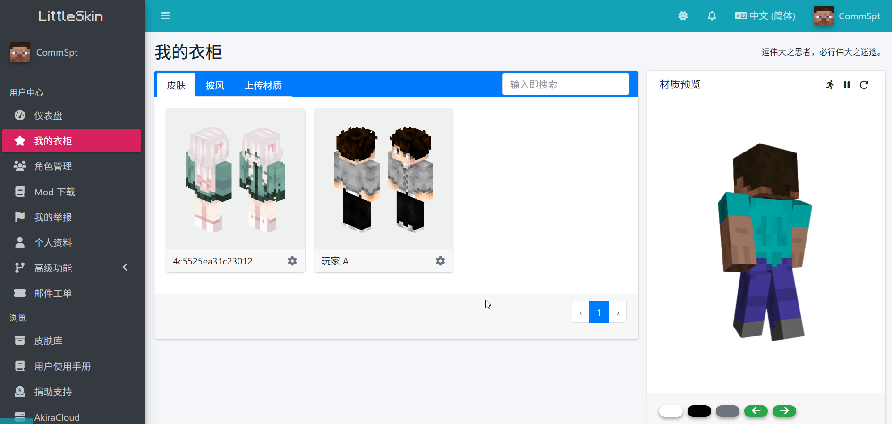

# 设定材质

创建好角色后，你就可以将材质应用到角色上了。

你可以上传你自己的材质，也可以直接从皮肤库中添加材质到衣柜。

## 上传材质

如果你拥有材质的源文件，你可以将其上传到皮肤库中。只有在皮肤库中的材质可以被添加到衣柜。

LittleSkin 支持上传以下材质

- 单层皮肤（大小为 64\*32 或其整数倍）
- 双层皮肤（大小为 64\*64 或其整数倍）
- 64\*32 的披风（但不支持 22\*17 的披风），鞘翅的材质应该直接画在披风上。

所有材质文件都应该是 PNG 格式的图片。

> [!IMPORTANT] 关于 PNG 格式
> 作为一种带有透明度通道的格式，PNG 指的不仅仅是文件名后缀为 `.png`，更为重要的是 PNG 格式的规范。
>
> <mark>若只是把其他格式的图片简单地重命名，将会出现异常现象。</mark>

> [!NOTE] 关于积分
>
> 下述内容可在 [积分系统](../score) 章节中找到。
>
> 上传材质需要花费积分，而花费的积分数量按照材质文件的体积来计算。
>
> - 对于公开材质，每 KB 存储空间需要花费 1 积分
> - 对于私密材质，每 KB 存储空间需要花费 20 积分
> - 删除材质时会返还积分
>
> 公开材质被他人收藏后，你可以获得奖励积分。
>
> - 公开材质被收藏一次可以获得 10 积分
> - 如果有一个衣柜收藏被删除，会扣除 10 积分

> [!NOTE] 注意
> 材质上传页面显示的预估积分消耗仅供参考，实际积分消耗将按材质文件的实际大小计算。

1. 进入<BSSection><FA :icon="faArchive"/> 皮肤库</BSSection>，点击页面顶部菜单栏中的<BSButton style="background-color: #17a2b8;"><FA :icon="faUpload"/> 上传新皮肤</BSButton>

2. 在打开的页面中设置材质名称，选择材质类型，选择材质文件，选择是否设置为私密。
    你可以在右侧查看你的材质的预览。
    材质信息设置完成后，点击<BSButton style="background-color: #28a745;">确认上传</BSButton>按钮。

    > [!CAUTION] 谨记
    > LittleSkin 不允许上传包括但不限于如下内容的敏感材质（包括含有争议性的材质）：
    >
    > - **高清的** 色情敏感的材质
    > - 政治敏感的材质
    > - 违反中国大陆地区、香港特别行政区和美国相关法律的材质
    >
    > 对于敏感材质，你需要在上传时将其设为私密材质，否则一经发现，相关材质将被删除，且你将被 LittleSkin **永久封禁**。

:sparkles: 你的材质就上传完成啦~

材质上传完成后，会自动跳转到你刚刚上传的材质的详情页面。

你上传的材质会被自动添加到你的衣柜，你可以直接前往<BSSection><FA :icon="faStar"/> 我的衣柜</BSSection>页面查看并设置到你的角色上。

## 从皮肤库中添加材质到衣柜

如果你想要使用的材质已经在皮肤库中，你可以直接将其收藏到衣柜中使用。

> [!IMPORTANT] 提示
每收藏一件材质至衣柜需要花费 10 积分。在衣柜中删除材质时会返还积分。
::::

1. 进入材质详情页面，点击材质预览下方左侧的<BSButton style="background-color: transparent; color: #007bff; border-color: #007bff;">添加至衣柜</BSButton>

2. 在弹出的对话框中设置衣柜物品的名字，点击<BSButton>确定</BSButton>

:sparkles: 材质就被成功添加到衣柜啦~

添加完成后，你也可以直接在材质详情页面将材质设置到角色。

## 将材质设置到角色

将材质添加到衣柜后，就可以将材质设置到角色上了。

你可以在用户中心的<BSSection><FA :icon="faStar"/> 我的衣柜</BSSection>页面管理衣柜物品和将材质设置到角色上。

1. 点击用户中心左侧菜单栏中的<BSSection><FA :icon="faStar"/> 我的衣柜</BSSection>

2. 在打开的页面的左侧上方选择材质的分类<BSSection>皮肤</BSSection><BSSection>披风</BSSection>，选择你要使用的材质，点击右侧材质预览下方左侧的<BSButton>使用...</BSButton>

3. 在弹出的窗口中选择需要设置材质的角色

:sparkles: 材质已经被设置到角色啦~

如果你以后还想要更换材质，或者想为其他角色设置材质，也可以按照这份文档中所述的方法来操作。

## 更换头像

你可以将衣柜中的皮肤的面部设置为你在 LittleSkin 的头像。

在衣柜中选择<BSSection>皮肤</BSSection>分类，点击衣柜物品底端右侧的齿轮按钮，再点击<BSButton>设为头像</BSButton>即可。会自动裁剪皮肤的面部作为头像。

