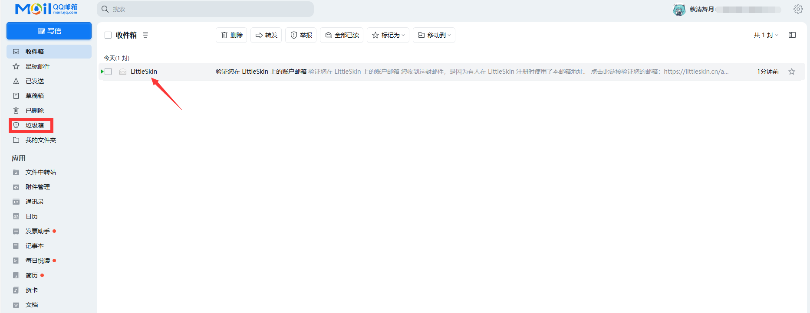

# 验证邮箱

欢迎加入LittleSkin大家庭🎉

看到此处你肯定已经注册了LittleSkin账号！

但你离创建角色-进入游戏的过程还差最后一步:**验证你的邮箱！**

以QQ邮箱(网页版新版)为例
1.打开 [<BSSection><FA :icon="faEnvelope" /> QQ邮箱官网</BSSection>](https://mail.qq.com) 页面并登录你的QQ账号，点击邮件主题为 <BSSection>LittleSkin</BSSection> 的信件

::: warning 注意
LittleSkin发送的验证信如果没有在 **收件箱** 发现，有可能是邮件系统将信件放入到了 **垃圾箱** (上图框中区域为垃圾箱入口)，请去垃圾箱找到此信件进行下一步操作
:::

::: tip 提醒
如果你没有在 收件箱 和 垃圾箱 找到你的邮件，你可以在 [<BSSection><FA :icon="faTachometer" /> 仪表盘</BSSection>](https://littleskin.cn/user) 中找到 <BSSection><FA :icon="faEnvelope" /> 验证你的邮箱地址</BSSection>，然后点击 <u>点击这里再次发送。</u> 以重新发送邮件到你的邮箱
:::

2.点击以 <BSSection>LittleSkin</BSSection> 为邮件主题的文件，然后点击邮件里提供的**链接**进入 <BSSection>LittleSkin</BSSection> 的邮箱验证网站

::: warning 注意
客户端用户请把 **链接** 复制到 **第三方浏览器**，请**不要**使用邮箱APP的内置浏览器！！！
:::

3.输入你的邮箱账号，然后点击<BSSection>提交</BSSection>

4.大功告成🎉
你现在可以进行 [<BSSection><FA :icon="faUsers" /> 创建角色</BSSection>](https://littleskin.cn/user/player) 的步骤啦！

# 其他邮件网页版/客户端

与上图操作相似，请在各自邮箱提供商的 **收件箱** 和 **垃圾箱** 寻找来自 <BSSection>LittleSkin</BSSection> 的邮件

<NCard title="😢 忘记密码了怎么办？" link="/faq/site#forgot-password" >
前去查看常见问题解答 FAQ 中的相关内容
</NCard>
