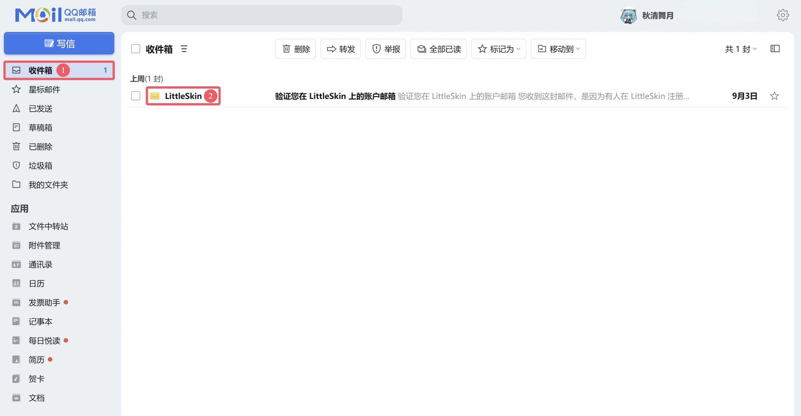

# 验证账户

欢迎加入 LittleSkin 大家庭🎉

看到此处，你应该已经成功注册了 LittleSkin 账号！🎉🎉

但你离创建角色到进入游戏的过程还差最后一步：验证你的邮箱。

## 以 QQ 邮箱为例

1. 打开 [QQ 邮箱官网](https://mail.qq.com) 页面并登录你的 QQ 账号，打开 **收件箱-①** 后查看主题为 **LittleSkin-②** 的邮件

<NCard title="😢 收不到验证邮件？" link="/faq/site#no-email" >
前去查看关于验证邮件无法收到的解决办法
</NCard>

2. 点击以 **LittleSkin** 为邮件主题的文件，然后点击邮件里的链接进入 LittleSkin 的邮箱验证页面

> [!IMPORTANT] 注意
> 请始终使用浏览器访问邮件中的链接。
>
> 从手机 QQ 或 QQ 邮箱 APP 内置的浏览器中直接访问链接可能会产生错误。

3. 输入你注册 LittleSkin 时提供的邮箱，然后点击 <BSSection>提交</BSSection> 按钮

4. 大功告成🎉

  你已成功验证账号！

你现在可以进行 [<BSSection><FA :icon="faUsers" /> 创建角色</BSSection>](https://littleskin.cn/user/player) 的步骤啦！

## 其他邮件网页版/客户端

与上述操作相似，请在各自邮箱提供商的网页或 APP 的 **收件箱** 和 **垃圾箱** 寻找由 **LittleSkin** 发出的验证邮件

<NCard title="😢 忘记密码了怎么办？" link="/faq/site#reset-password" >
前去了解如何重置自己的密码
</NCard>
