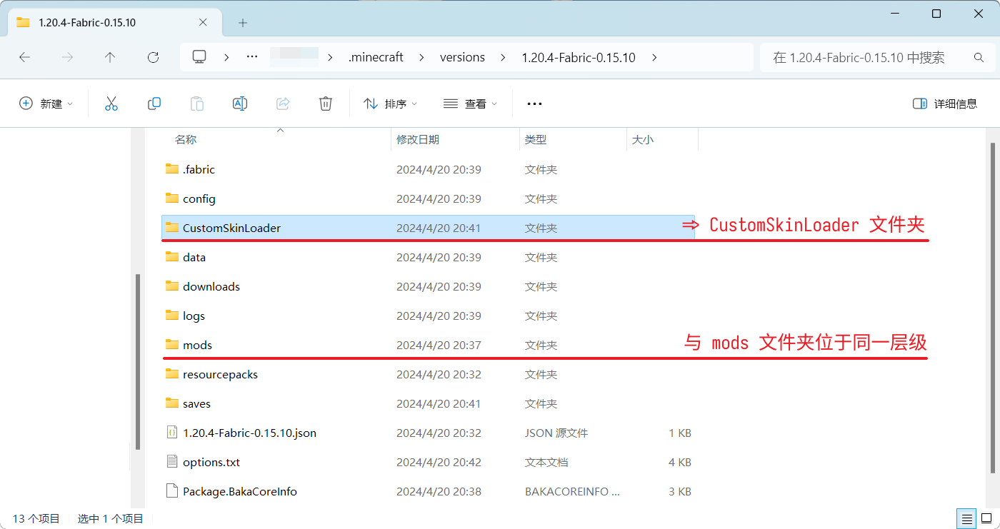
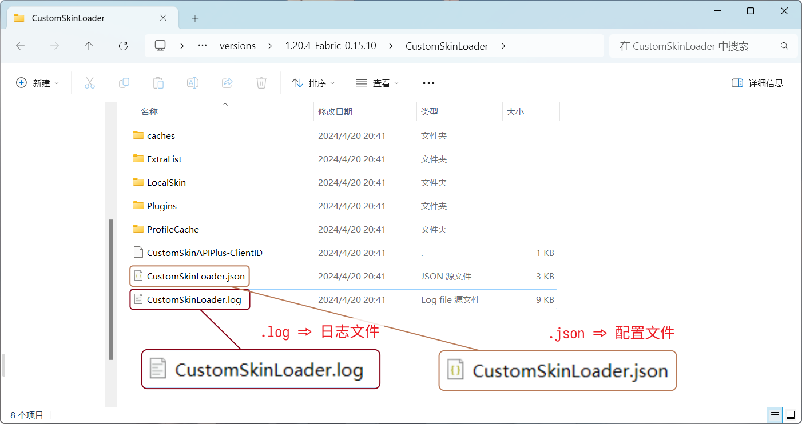

# 遇到问题的应对方法

任何事物都不是十全十美的——LittleSkin 也是自然。所以，如果你在使用 LittleSkin 的过程中遇到了任何问题（包括但不限于：材质无法显示、网站出现错误），你可以按照下述内容的指导、逐步找到问题的解决方案。

## 「自检」

绝大多数情况下的 LittleSkin 很稳定。因此，在遇到问题时，你应该尝试「自检」，也就是检查问题是否发生在你的设备上。

👉 网络异常、操作失误甚至你所使用的浏览器都可能导致你无法正常使用 LittleSkin。<mark>请先以自己的经验判断一下，你的问题是否是前几种或类似的因素造成的。</mark>

👉 如果你难以判断，请**阅读一遍 《常见问题解答 / FAQ》**。<mark>通常有许多人也遇到了和你一样的问题，它们也被总结出了解决方案。</mark>或许 FAQ 就有解决你的问题的方案呢？

<NCard title="🤔 常见问题解答 / FAQ" link="/faq/">
说不定就有你正在努力寻找的答案。
</NCard>

如果你「自检」完成并确认问题并不是发生在你的设备上，那么可以着手准备报告问题了。

## 报告问题

### 不要「闭眼开车」

我们相信，你总在某个地方看到过这句出自 Apache httpd 文档的句子：

> _Troubleshooting any problem without the error log is like driving with your eyes closed._
> _（在没有错误日志的情况下诊断问题无异于闭眼开车。）_
> ——[Apache httpd - Getting Started](https://httpd.apache.org/docs/2.4/getting-started.html)

因此，在报告问题之前，<mark>请接受 **只言片语 = 闭眼开车** 这个事实，并且不要让自己成为「闭眼开车」的人。</mark>在没有任何日志或报错截图的辅助下，我们无法通过「皮肤站出错了」、「无法加载皮肤」这种简洁至极的描述去快速定位并解决你的问题。

### 我应如何报告问题？

如果你不清楚要如何报告问题，可以尝试根据下述步骤草拟问题报告。

#### 提问的主题

你是想提问游玩 Minecraft 时遇到的问题，还是使用 LittleSkin 时遇到的问题？

如果是前者，很抱歉，这些步骤仅适用于后者。我们也乐意为你提供适用于前者的帮助——前提是你需要在我们的闲聊群 [Honoka Café](https://manual.littlesk.in/user-group#cafe) 提问这些问题。

#### 详细的描述

用简短但有力的文字描述你所遇到的问题。这样，纵使你无法第一时间提供相关信息，我们的支持团队也会指导你提供它们。

#### 复现步骤

提供复现步骤可极大节省我们解决这个问题所耗费的时间。尝试着根据下述两个问题来告诉我们如何复现这个问题：

1. 你想要做些什么？最终能达成什么？
2. 截至问题出现，你做了一些什么？_换句话说，是做了什么导致问题的出现？_

#### 环境信息

提供你的环境信息有利于我们更快判断问题所在。

- 若是网站上出现的问题，请告诉我们你的浏览器版本、操作系统版本及网络环境信息；
- 若是游戏内出现的问题，请告诉我们你的游戏版本、游戏类型（单人游戏或多人游戏）、Mod 列表和 Java 版本。

#### <Badge type="info" text="网站" />报错截图

LittleSkin 发生错误时，用户会看到对应的错误提示——可能是红色弹窗，也可能是页面提示。

<mark>请截取出现错误时的网站页面，并在提问时提供截图源文件。**注意：不要拍屏。**</mark>

#### <Badge type="info" text="游戏" />日志文件

日志文件记录了程序在运行过程中的详细信息，包括操作记录、错误提示、警告信息等，是侦错时必不可少的信息。

如果有，提问时请务必带上这些日志文件。

> [!NOTE] 注意版本隔离
> 为了隔离一台设备上的多个 Minecraft 版本、整合包、Mod 等，很多启动器都使用了版本隔离技术，以确保他们之间互不干扰。
>
> 考虑到版本隔离的情况，一些文件的将会提供两个路径，以方便查找。
>
> 下述列出的版本隔离路径中的 `{version}` 只是一个占位符，对应你所使用的客户端版本。**实际路径不需要带大括号。**

> [!TIP] 启动器提供的便捷功能
> 许多启动器都带有类似于 <BSSection>打开游戏文件夹</BSSection> 的功能，可以很方便地应对版本隔离的情况。

##### <Badge type="info" text="皮肤 Mod" /> CustomSkinLoader

CustomSkinLoader 的日志文件位于 `.minecraft/CustomSkinLoader/CustomSkinLoader.log`，

在使用版本隔离的情况下则为 `.minecraft/versions/{versions}/CustomSkinLoader/CustomSkinLoader.log`。

::: details 图示：日志文件的具体位置

:::

##### <Badge type="info" text="外置登录" /> authlib-injector

如果是 Yggdrasil 外置登录的问题，请在启动游戏时额外添加 JVM 参数 `-Dauthlibinjector.debug` 并尝试复现问题。若问题复现成功，请提供以下日志文件：

1. 服务端从开始到出错的日志文件；
  - 最后一次运行服务端生成的日志位于 `logs/latest.log`；
2. 客户端游戏从开始到出错的日志文件；
  - 最后一次游戏生成的日志位于 `.minecraft/logs/latest.log` 或 `.minecraft/versions/{versions}/logs/latest.log`；
  - 一些主流的启动器自带了 <BSSection>测试游戏</BSSection> 功能，请优先使用该功能导出日志文件；
3. 服务端和客户端的 authlib-injector 日志文件；
  - 最后一次生成的日志文件位于客户端游戏目录或服务端根目录下的 `authlib-injector.log`；
4. 启动器日志文件；
  - 如果不知道启动器日志在哪里，请咨询启动器作者。

<mark>提问时请提供日志源文件，**不要发送截图甚至拍屏**。如果没有日志文件，请在提问时第一时间说明清楚。</mark>

:::tip 可能需要提供更多信息

我们会在你提问后要求你提供更多的信息。请提供对应信息以帮助我们定位问题。

:::

### 我应该在哪里提问？

<NCard title="🙋 加入用户交流群" link="/user-group" >
你可以加入我们的官方用户交流群来提问
</NCard>
<NCard title="📬️ 通过邮件发送工单" link="/email" >
也可以给我们发送邮件工单
</NCard>
<NCard title="🧑‍🔬 一对一技术支持" link="https://afdian.com/a/tnqzh123" >
也可以通过 <strong>💰赞助支持</strong> 来获取高质量的一对一技术支持服务
</NCard>

