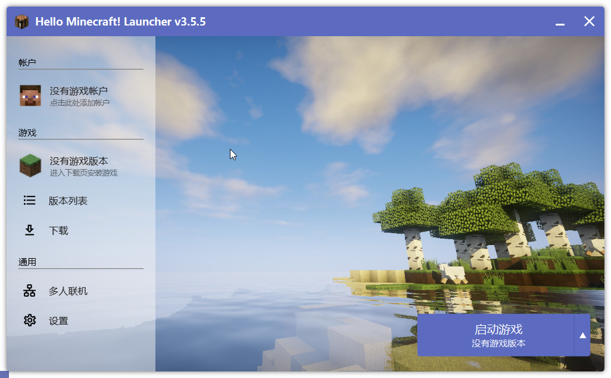

# 在客户端配置 Yggdrasil 外置登录

<!-- @include: @/pay-for-minecraft.template.md -->

> [!TIP] 在多人游戏中的提示
> 为客户端配置 Yggdrasil 外置登录确实能起到「在多人游戏中加载皮肤」的作用，但是这是建立在服务端已经正确配置了外置登录的基础上的。
>
> 仅仅在客户端使用 LittleSkin 的外置登录服务并不能达到任何效果。
>
> 此外，LittleSkin 的外置登录并不能代替正版验证，也<mark>不能帮助你进入仅支持正版的服务器</mark>。

<NCard title="🤔 什么是外置登录？" link="/yggdrasil/#什么是外置登录" >
与离线登录的区别 / 基本原理 / 优缺点 / ...
</NCard>

> [!WARNING] 😱 忘记了密码？
> 重置密码并非难事，只需要在 LittleSkin 网站上点击右上角的头像退出登录，再在登录页面上找到 <BSSection>忘记密码？</BSSection> 链接，点击后按提示操作即可。

## HMCL 3

> [!TIP] ✅ 无需再手动添加认证服务器
> HMCL 3 已将 LittleSkin 添加为默认选项之一，直接点击相关界面中的 LittleSkin 选项即可。

1. 进入账户列表，在左侧菜单中选择 LittleSkin，填写你的邮箱和密码。

   「用户名」即为你在 LittleSkin 的账号的邮箱，也可以是任意一个你拥有的角色名。

2. 选择你的游戏角色。

    如果你只有一个角色，那么 HMCL 3 会默认选择那个唯一的角色。

    如果你希望添加多个角色，你可以再次添加你的账号来添加其他角色。

🎉 设置完成啦！你已经可以启动游戏了。

## BakaXL

<https://www.bilibili.com/video/BV1W741197Bv>

> [!CAUTION] ‼️ 此视频较为久远，其中展示的验证服务器地址已经严重过时
>
> 当前的验证服务器地址为 `https://littleskin.cn/api/yggdrasil`。

<iframe src="//player.bilibili.com/player.html?isOutside=true&aid=99799339&bvid=BV1W741197Bv&cid=170308127&p=1" scrolling="no" border="0" frameborder="no" framespacing="0" allowfullscreen="true" style="width: 100%; height: 28rem"></iframe>

## 联机 Mod

使用外置登录进行联机时，无需安装如 [CustomSkinLoader 万用皮肤补丁](../newbee/csl) 这样的皮肤 Mod 也可以正常在游戏中加载材质。

通常情况下，所有玩家使用外置登录启动游戏，且发起方启用 <BSSection>对局域网开放</BSSection> 功能，即可完成联机。部分玩家可能会安装联机 Mod，这类 Mod 通常提供更细致的配置菜单和丰富功能。

> [!NOTE] 常见的联机 Mod
>
> - [[OL] 开放式联机 OpenLink](https://www.mcmod.cn/class/17345.html)
> - [[LSP] 自定义局域网联机 Lan Server Properties](https://www.mcmod.cn/class/2754.html)
> - [[mcwifipnp] 更高级联机设置 LAN World Plug-n-Play](https://www.mcmod.cn/class/4498.html)

> [!IMPORTANT] 需要使用外置登录启动游戏
> 参与联机的所有玩家都必须使用外置登录启动游戏，否则无法加入联机。

为了确保外置登录能正常工作，请在这些 Mod 的配置菜单中设置 <BSSection>正版验证：开</BSSection> 或 <BSSection>在线模式：开</BSSection> 选项。
