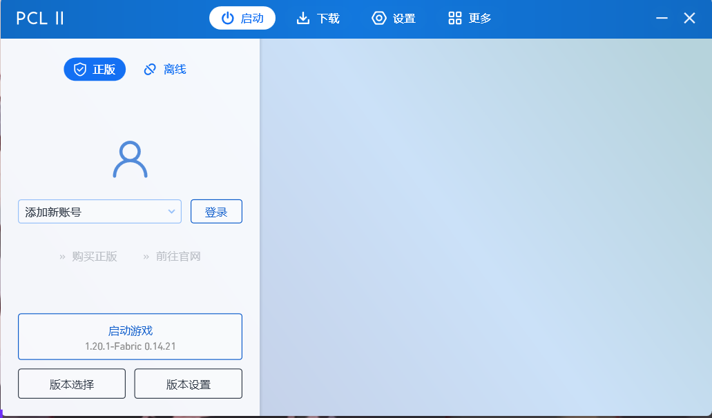

# 在客户端配置 Yggdrasil 外置登录

## HMCL 3

::: tip 提示

HMCL 3 已将 LittleSkin 添加为默认选项之一，因此无需再手动添加认证服务器。

:::

1. 进入账户列表，在左侧菜单中选择 LittleSkin，填写你的邮箱和密码。「用户名」即为你在 LittleSkin 的账号的邮箱，也可以是任意一个你拥有的角色名。

    如果你只添加了一个认证服务器，那么 HMCL 3 会默认选中那个唯一的认证服务器。

2. 选择你的游戏角色。

    如果你只有一个角色，那么 HMCL 3 会默认选择那个唯一的角色。

    如果你希望添加多个角色，你可以再次添加你的账号来添加其他角色。

:tada: 设置完成啦！你已经可以启动游戏了。

## PCL 2

::: tip 提示

PCL 2 已将 LittleSkin 添加为默认选项，因此无需再手动添加认证服务器。

:::

1. 进入 `版本设置` - `设置` 页面，下拉找到 `服务器` 栏，登录方式选择 `第三方登录：Authlib Injector 或 LittleSkin`，单击出现的 `设置为 LittleSkin` 按钮并返回首页
2. 在首页登陆处填写你的邮箱和密码，并点击 启动游戏 来进行登陆
3. 如果你拥有多个角色，请在弹出的窗口中选择您所需的角色
   
:tada: 设置完成啦！你已经可以使用你选择的角色来进行游戏了。

## BakaXL 3

::: tip 提示

在使用 BakaXL 时，您需要手动添加验证服务器，LittleSkin 的验证服务器地址为 `https://littleskin.cn/api/yggdrasil`

:::

这里是来自 [@TT702](https://space.bilibili.com/515094) 的视频教程 [BakaXL 使用指南 | 创建第三方验证模式 Minecraft 用户档案的窍门](https://www.bilibili.com/video/BV1W741197Bv/)

1. 进入本体设置，选择 `账户与档案`，在 `Minecraft 游戏档案` 一栏中选择 `新建一个档案`
2. 将游戏启动模式改为 `外置登录(authlib-injector)`，在验证服务器一栏中填入 LittleSkin 的验证服务器地址，输入您的邮箱与密码后，点击左侧 `进行验证并返回` 按钮
3. 选择你的游戏角色。

    如果你只有一个角色，那么 BakaXL 会默认选择那个唯一的角色。

    如果你希望添加多个角色，你可以再次添加你的账号来添加其他角色。
    
:tada: 设置完成啦！你已经可以使用你选择的角色来进行游戏了。